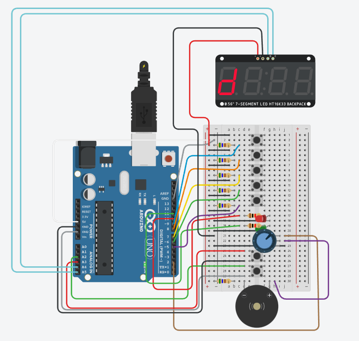

# Arduino Piano

A digital music synthesizer with melody recording and playback functionality, built on the Arduino platform.


## Table of Contents

- [About the Project](#about-the-project)
- [Features](#features)
- [Components](#components)
- [Wiring Diagram](#wiring-diagram)
- [Installation](#installation)
- [Usage Instructions](#usage-instructions)
- [Tinkercad Simulation](#tinkercad-simulation)
- [Authors](#authors)

## About the Project

**Arduino Piano** is a functional musical instrument based on Arduino that enables playing simple melodies as well as recording and playback. The project combines elements of digital electronics, microcontroller programming, and audio signal processing.

### Main Features:
- 5 buttons representing notes of the C major scale (C, D, E, F, G)
- Recording mode with visualization (red LED)
- Playback mode for saved melodies (green LED)
- 7-segment display showing the currently played note
- Sound generation through piezo buzzer
- Ability to save up to 100 notes

### Circuit Layout


*Figure 1: Complete circuit layout in Tinkercad showing all components and connections*

## Features

### 1. Normal Play Mode
- Press note buttons to play melodies in real-time
- Each note is displayed on the LED display
- Generation of sounds at appropriate frequencies (261-392 Hz)

### 2. Melody Recording
- Press the **RECORD** button to start recording
- The red LED lights up
- Play the melody - all notes are saved with duration
- Press **RECORD** again to finish

### 3. Melody Playback
- Press the **PLAY** button to play the saved melody
- The green LED lights up
- The device automatically plays all saved notes
- Visualization of each note on the display

### 4. Serial Port Debugging
- Real-time application state monitoring
- Button press logging
- Information about the number of saved notes

## Components

| Component | Quantity | Description |
|-----------|----------|-------------|
| Arduino Uno/Nano | 1 | ATmega328P Microcontroller |
| Piezo Buzzer | 1 | Sound Generator |
| Push Buttons | 7 | 5x notes + RECORD + PLAY |
| 7-segment LED Display | 1 | 4-digit with HT16K33 controller (I2C) |
| Red LED | 1 | Recording Indicator |
| Green LED | 1 | Playback Indicator |
| Resistors | - | Pull-down for buttons, LED protection |
| Breadboard + wires | 1 | Prototype assembly |

## Wiring Diagram

```
┌─────────────────────────────────────────┐
│           ARDUINO UNO/NANO              │
├─────────────────────────────────────────┤
│ D2  → Piezo Buzzer (Audio PWM)          │
│ D5  → Button Note G                     │
│ D6  → Button Note F                     │
│ D7  → Button Note E                     │
│ D8  → Button Note D                     │
│ D9  → Button Note C                     │
│ D10 → Red LED (Recording)               │
│ D11 → Green LED (Playback)              │
│ A2  → Button PLAY                       │
│ A3  → Button RECORD                     │
│ A4  → LED Display (SDA - I2C)           │
│ A5  → LED Display (SCL - I2C)           │
│ GND → Common Ground                     │
│ 5V  → Display and LED Power             │
└─────────────────────────────────────────┘
```

### Note Frequencies

| Note | Frequency | Pin |
|------|-----------|-----|
| C | 261.63 Hz | D9 |
| D | 293.66 Hz | D8 |
| E | 329.63 Hz | D7 |
| F | 349.23 Hz | D6 |
| G | 392.00 Hz | D5 |

## Installation

### Requirements
- Arduino IDE (version 1.8.x or newer)
- `Wire.h` library (built into Arduino IDE)
- USB cable for programming Arduino

### Installation Steps

1. **Clone the repository:**
   ```bash
   git clone https://github.com/your-username/arduino-piano.git
   cd arduino-piano
   ```

2. **Open the project in Arduino IDE:**
   ```
   File → Open → source.ino
   ```

3. **Select the board:**
   ```
   Tools → Board → Arduino Uno (or Nano)
   ```

4. **Select the COM port:**
   ```
   Tools → Port → [select USB port]
   ```

5. **Upload the code:**
   ```
   Sketch → Upload (Ctrl+U)
   ```

6. **Open Serial Monitor:**
   ```
   Tools → Serial Monitor (9600 baud)
   ```

## Usage Instructions

### First Launch
1. Connect Arduino to the computer via USB
2. Wait for the message `"Piano ready!"` in the Serial Monitor
3. The device is ready to use

### Playing Melodies
```
1. Press note buttons (C, D, E, F, G)
2. Watch the LED display - it shows the current note
3. Listen to sounds from the piezo buzzer
```

### Recording
```
1. Press RECORD (red LED lights up)
2. Play the melody
3. Press RECORD again (LED turns off)
4. Serial Monitor shows: "*** RECORDING FINISHED - saved X notes ***"
```

### Playback
```
1. Press PLAY (green LED lights up)
2. The device plays the saved melody
3. After completion, the LED turns off
```

> **Note:** If there is no saved melody, you will hear a double error signal (200 Hz).

## Tinkercad Simulation

The project can be tested without physical components in the Autodesk Tinkercad environment:

**Link: [Open project in Tinkercad](https://www.tinkercad.com/things/eABRWKvcff0)**

### Simulation Advantages:
- Testing the circuit without hardware
- Virtual connection debugging
- Interactive 3D visualization
- Safe experimentation
